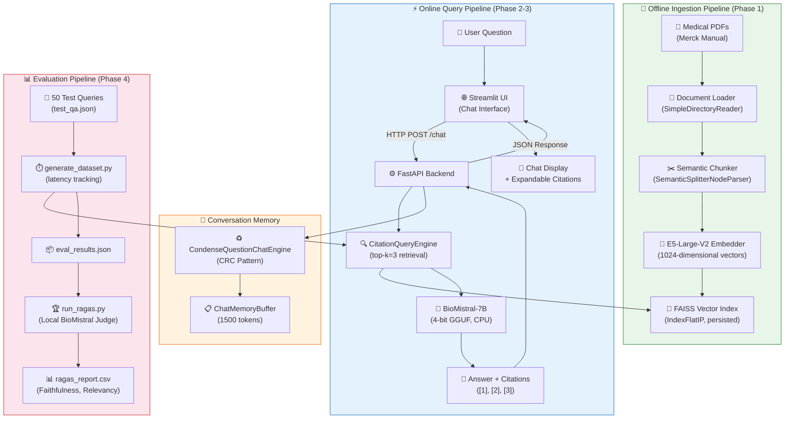

# ClinRAG — System Architecture

## Full Pipeline Diagram

## Component Descriptions

| Component | Module | Purpose |
|-----------|--------|---------|
| Document Loader | `src/ingestion/document_loader.py` | Reads PDF files using LlamaIndex's `SimpleDirectoryReader` |
| Semantic Chunker | `src/ingestion/chunker.py` | Splits text at natural topic boundaries using embedding similarity |
| Embedder | `src/ingestion/embedder.py` | Generates 1024-dim vectors using `intfloat/e5-large-v2` |
| Index Builder | `src/ingestion/build_index.py` | Orchestrates ingestion and persists FAISS index |
| BioMistral LLM | `src/llm/biomistral.py` | 4-bit quantized medical LLM via `llama-cpp` |
| Citation Query Engine | `src/rag/query_engine.py` | Retrieves top-3 passages and injects inline `[1][2][3]` citations |
| Chat Engine | `src/rag/chat_engine.py` | Condense-Rephrase-Chat pattern with 1500-token memory |
| FastAPI Backend | `src/api/main.py` | REST API loading the full pipeline once on startup |
| Streamlit UI | `src/ui/app.py` | Chat interface with expandable citation dropdowns |
| Dataset Generator | `src/eval/generate_dataset.py` | Runs test queries, records latency and citations |
| RAGAS Evaluator | `src/eval/run_ragas.py` | Offline Faithfulness and Answer Relevancy grading |

## Data Flow Summary

1. **Offline**: PDFs → Semantic Chunks → E5 Embeddings → FAISS Index (stored on disk)
2. **Online**: User Question → FastAPI → Retrieve Top-3 Chunks → BioMistral generates Answer with Citations → Streamlit displays Answer + Citation Expander
3. **Evaluation**: 50 Test Questions → Pipeline → RAGAS grades Faithfulness & Relevancy → CSV Report
